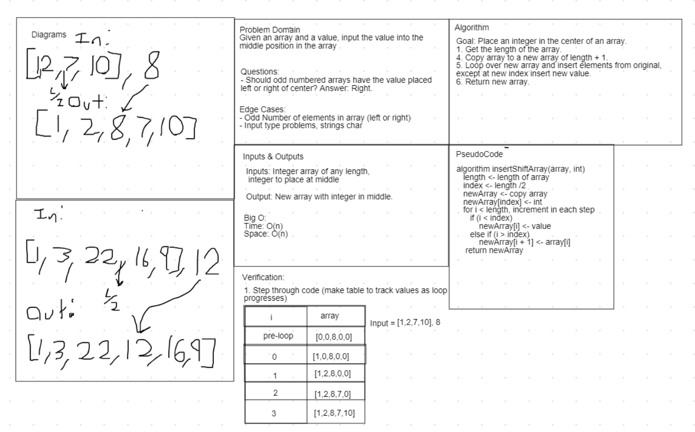

# Challenge 02: ArrayShift

Write a function called `InsertShiftArray` that takes two parameters: an array of integers, and a single integer value. The function will build an array that consists of all the elements in the original array, plus the integer value inserted in the middle (see next paragraph) of the array. The function will then return this array.

For an array with an even number of elements, the integer value will simply be inserted at the middle element. So [1, 2, 3, 4] will have 5 inserted as such: [1, 2, 5, 3, 4]. For an array with an odd number of elements, the integer will be inserted to the *right* of the middle. So [1, 2, 3] will have 4 inserted as such: [1, 2, 4, 3].

## Approach & Efficiency

One approach was taken. 

1. Time O(n) / Space O(n) - We calculated the middle index value, copied the array to a new array of length + 1, and then looped over the array and copied its elements to the new array (assigning the integer value to its appropriate index value first).

We discussed whether it was possible to accomplish this task in a more efficient Big O Time, possibly O(log n), but couldn't think of a solution.

## Solution

## Link to Code

[InsertShiftArray()](Program.cs)

## Change Log

- 1.0: Code Challenge 02: ArrayShift - 2020-07-07