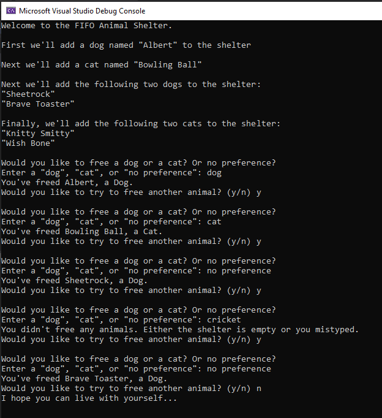

# Challenge 12: FIFO Animal Shelter

A .NET Console App the implements a FIFO Animal Shelter. Allows getting the cat or dog that has been in the shelter the longest, or allows a client class to specify "no preference" in which case the animal that has been in the shelter the longest is returned.

- `Enqueue(Animal animal)` - stores any object, with FIFO ordering, that inherits from the abstract Animal class.
- `Dequeue(string pref)` - retrieves a Cat or a Dog object, or returns null, depending on the state of AnimalShelter.

## Approach & Efficiency

- `Enqueue(Animal animal)`
    - Time: O(1)
    - Space: O(1)
- `Dequeue(string pref)`
    - Time: O(1)
    - Space: O(1)

## Example

## Solution

### Whiteboard (if applicable)

## Links to Code

- [AnimalShelter.cs](Classes/AnimalShelter.cs)
- [Animal.cs (Abstract Class)](Classes/Animal.cs)
- [Dog.cs (Concrete Class)](Classes/Dog.cs)
- [Cat.cs (Concrete Class)](Classes/Cat.cs)

## Change Log

### 2020-21-07
- Class Structure - 18:57 PDT
- Testing Complete - 19:42 PDT
- Console App - 21:24 PDT