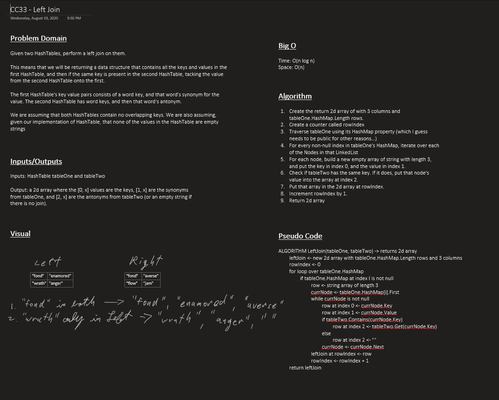

# Challenge 33: Left Join

Left joins [(see explanation)](https://www.tutorialspoint.com/sql/sql-left-joins.htm) two HashTables, and returns a new HashTable of LeftJoinNodes.

- `LeftJoinHashTables()` - takes two HashTables, one designated as the "left", and one as the "right", and left joins them.

## Approach & Efficiency

- Time: O(n)
- Space: O(n)

### Whiteboard

## Link to Code

- [LeftJoin.cs](LeftJoin/LeftJoin.cs)
- [LeftJoinNode.cs](LeftJoin/Classes/LeftJoinNode.cs)

## Change Log

### 2020-08-20

Improved implementation of [HashTable](../../data-structures/HashTables/), completed implementation of Left Join with tests.

### 2020-08-20

Initial attempt at implementation trying to follow the "suggested" diagramed implementation by returning a 2d matrix.