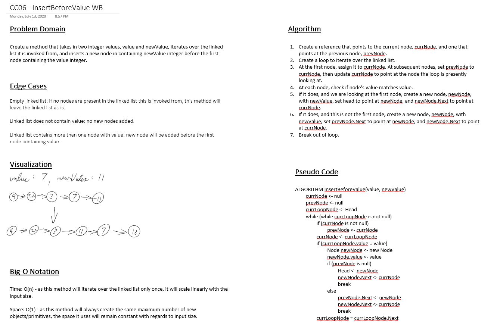

# Challenge 06: Linked List Insertion

Extend the linked list DLL to include the following new methods:

- `Append(int value)`: inserts the integer parameter "value" in a new node, at the end of the linked list.
- `InsertBefore(int value, int newValue`: inserts the integer parameter "newValue" before the first occurrence of a node with the integer parameter "value". If no nodes contain "value", leaves linked list as-is.
- `InsertAfter(int value, int newValue`: inserts the integer parameter "newValue" after the first occurrence of a node with the integer parameter "value". If no nodes contain "value", leaves linked list as-is.

## Approach & Efficiency

- `Append(int value)`
    - Time: O(n)
    - Space: O(1)
    - This method iterates over the linked list, finds the end, creates a new node, and inserts the new node at the end.
- `InsertBefore(int value, int new Value)`
    - Time: O(n)
    - Space: O(1)
    - This method iterates over the linked list, and if it finds a node that matches the parameter "value", inserts a new node with the parameter "newValue" before the node matching "value".
- `InsertBefore(int value, int new Value)`
    - Time: O(n)
    - Space: O(1)
    - This method iterates over the linked list, and if it finds a node that matches the parameter "value", inserts a new node with the parameter "newValue" after the node matching "value".

## Link to Code

[Linked List Class - Append(), InsertBefore(), and InsertAfter()](../Libraries/LLLibrary/LinkedList.cs#L81-L168)

## Solution

### InsertBefore() Whiteboard

## Change Log

- 1.0: Code Challenge 06: Linked Lists Insertion - 2020-07-13
