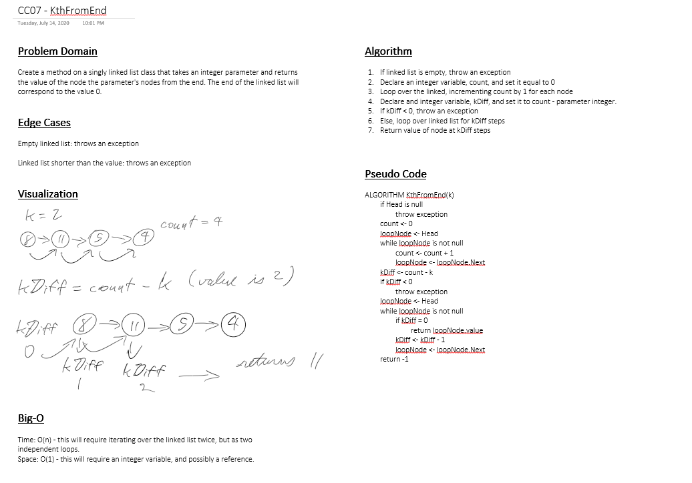

# Challenge 07: Kth Node From End

Extend the LinkedList class to include the following method:

- `KthFromEnd(int k)`: finds the Kth node from the end of the list, with k = 0 being the last node, and returns that node's value.

## Approach & Efficiency

- `KthFromEnd(int k)`
    - Time: O(n)
        - This methods needs to iterate over the linked list twice, but those iterations are sequential. Time scales linearly with the size of the LinkedList.
    - Space: O(1)
        - This methods creates one reference and two primitives, regardless of the size of the linked list. Space stays constant.

## Link to Code

[Linked List Class](../Libraries/LLLibrary/LinkedList.cs)

## Solution

### InsertBefore() Whiteboard

## Change Log

- 1.0: Kth Node From End of LinkedList - 2020-07-14