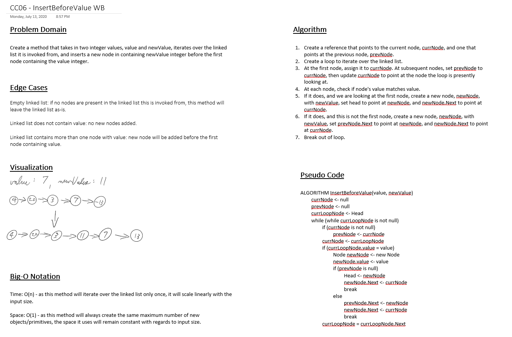
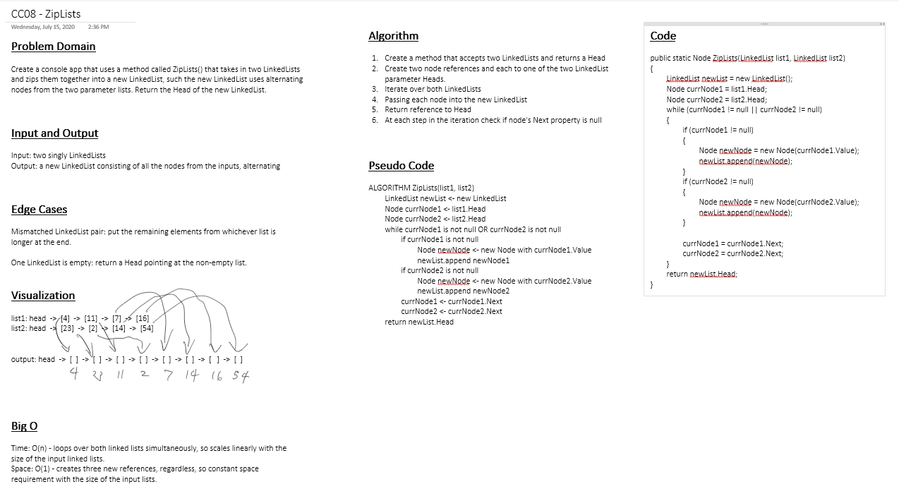

# Challenge 05: Linked List Implementation

Create a (singly linked) linked list and node class with the following methods:

- `Insert()`: takes an integer value, creates a new node and inserts that node at the beginning of the linked list.
- `Includes()`: take an integer value, and returns true if the linked list contains that value, or false if not.
- `ToString()`: prints to the console a useful representation of the linked list.

Linked list was created in class and is included here as a DLL.

## Approach & Efficiency

- `Insert()`
    - Time: O(1)
    - Space: O(1)
    - This method simply creates a the new node and changes two references.
- `Includes()`
    - Time: O(n)
    - Space: O(1)
    - This method iterates over the linked list until it finds a node that matches the value.
- `ToString()`
    - Time: O(n)
    - Space: O(n)
    - This method iterates over the linked list, building a StringBuilder object.

## Example

## Links to Code

- [Linked List Class](../../Libraries/LLLibrary/LinkedList.cs)
- [Node Class](../../Libraries/LLLibrary/Node.cs)

## Change Log

- 1.0: Code Challenge 05: Linked Lists - 2020-07-11

***

# Challenge 06: Linked List Insertion

Extend the linked list DLL to include the following new methods:

- `Append(int value)`: inserts the integer parameter "value" in a new node, at the end of the linked list.
- `InsertBefore(int value, int newValue`: inserts the integer parameter "newValue" before the first occurrence of a node with the integer parameter "value". If no nodes contain "value", leaves linked list as-is.
- `InsertAfter(int value, int newValue`: inserts the integer parameter "newValue" after the first occurrence of a node with the integer parameter "value". If no nodes contain "value", leaves linked list as-is.

## Approach & Efficiency

- `Append(int value)`
    - Time: O(n)
    - Space: O(1)
    - This method iterates over the linked list, finds the end, creates a new node, and inserts the new node at the end.
- `InsertBefore(int value, int new Value)`
    - Time: O(n)
    - Space: O(1)
    - This method iterates over the linked list, and if it finds a node that matches the parameter "value", inserts a new node with the parameter "newValue" before the node matching "value".
- `InsertBefore(int value, int new Value)`
    - Time: O(n)
    - Space: O(1)
    - This method iterates over the linked list, and if it finds a node that matches the parameter "value", inserts a new node with the parameter "newValue" after the node matching "value".

## Link to Code

[Linked List Class - Append(), InsertBefore(), and InsertAfter()](../Libraries/LLLibrary/LinkedList.cs)

## Solution

### InsertBefore() Whiteboard

## Change Log

- 1.0: Code Challenge 06: Linked Lists Insertion - 2020-07-13

***

# Challenge 07: Kth Node From End

Extend the LinkedList class to include the following method:

- `KthFromEnd(int k)`: finds the Kth node from the end of the list, with k = 0 being the last node, and returns that node's value.

## Approach & Efficiency

- `KthFromEnd(int k)`
    - Time: O(n)
        - This methods needs to iterate over the linked list twice, but those iterations are sequential. Time scales linearly with the size of the LinkedList.
    - Space: O(1)
        - This methods creates one reference and two primitives, regardless of the size of the linked list. Space stays constant.

## Link to Code

[Linked List Class](../Libraries/LLLibrary/LinkedList.cs)

## Solution

### InsertBefore() Whiteboard

## Change Log

- 1.0: Kth Node From End of LinkedList - 2020-07-14

***

# Challenge 08: ZipLists

Extend the LinkedList class to include the following static method:

- `ZipLists(LinkedList list1, LinkedList list2)`: combines the two LinkedLists into a one new one, by alternating between list1 and list2, with list1 first.

## Approach & Efficiency

- `ZipLists(LinkedList list1, LinkedList list2)`
    - Time: O(n)
        - This method loops over the two LinkedLists simultaneously, once, so it only scales linearly with increased input size.
    - Space: O(1)
        - This methods creates three new references, and space stays constant regardless of input size.

## Link to Code

[Linked List Class](LinkedList.cs#L218-L249)

## Solution

### InsertBefore() Whiteboard

## Change Log

- 1.0: Kth Node From End of LinkedList - 2020-07-14