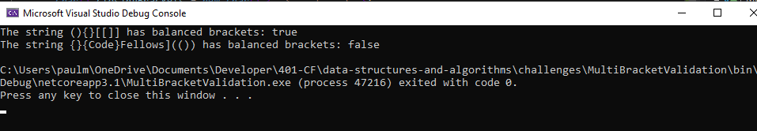
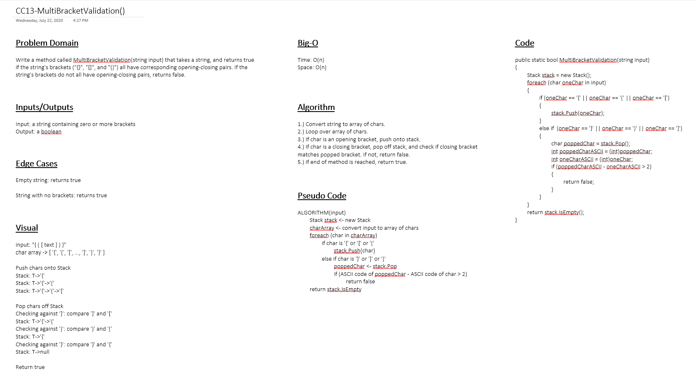

# Challenge 13: Multi-Bracket Validation

A method that takes a string as an input, and returns true if the string has balanced brackets ("{}", "[]", and "()"). Balanced meaning for each opening bracket there is one, and only one, corresponding closing bracket.

## Approach & Efficiency

- `MultiBracketValidation(input string)`:
    - Time: O(n)
    - Space: O(n)

## Example

## Solution

### Whiteboard

## Link to Code

- [Program.cs - Lines 19 - 49](Program.cs#L19-L40)

## Change Log

### 2020-07-22

- Refactored logic and README. 20:39 PDT
- Full testing and basic implementation. 19:41 PDT
- Basic testing structure in place. 19:21 PDT