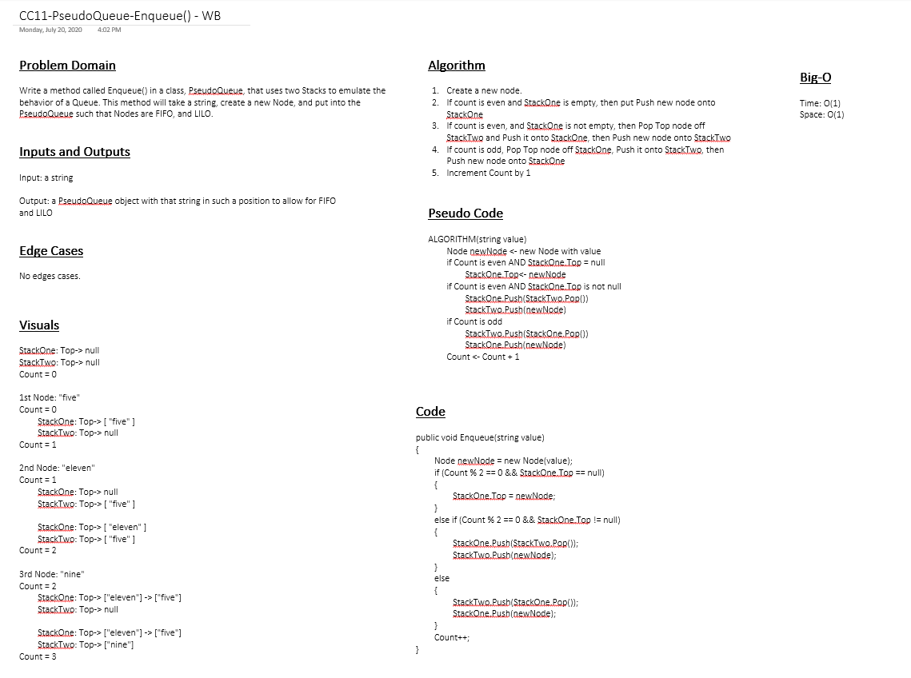

# Challenge 11: Queues With Stacks

Class library project implementing a queue data structure called PseudoQueue. PseudoQueue employs two Stacks under the hood for data storage and retrieval.

- `Enqueue(string value)`: takes in a string value and adds a node containing that value to the queue.
- `Dequeue()`: returns the value of the oldest node in the queue (FIFO).

## Approach & Efficiency

- `Enqueue(string value)`: O(n)
- `Dequeue()`: O(1)

## Solution

### Whiteboard (if applicable)

## Link to Code

[PseudoQueue.cs](Classes/PseudoQueue.cs)

## Change Log

2020-07-20 - `Enqueue()` and `Dequeue()` methods implemented.