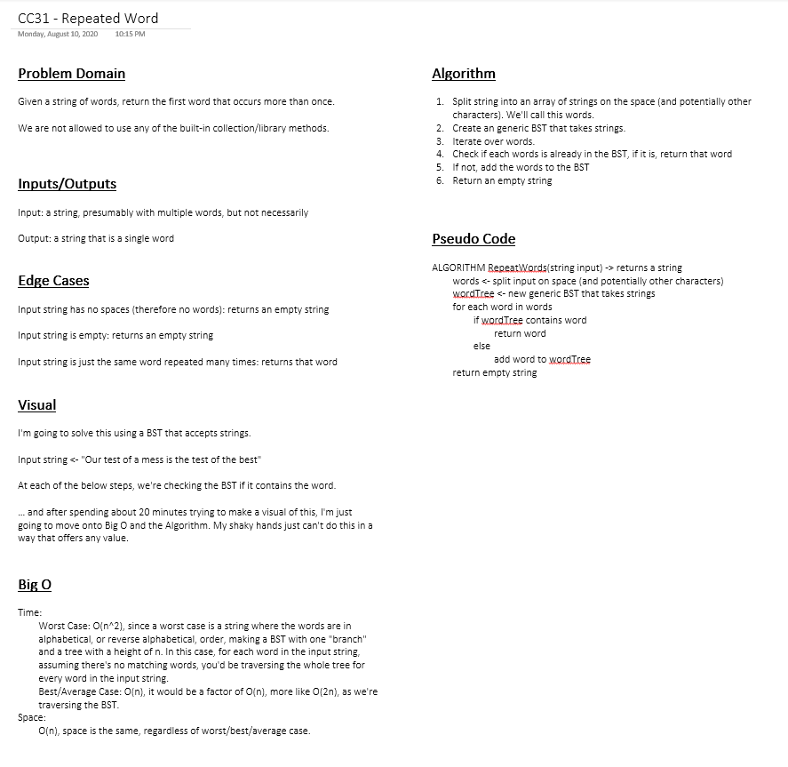

# Challenge 31: Repeated Word

A method that, given an input string of "words", returns the first word that repeats. Cannot employ and of the .NET/C# built-in data-structures.

 - `FindRepeatedWord(string input)`: class method, given the input string containing two or more words, returns the first word that occurs more than once (CI).

## Approach & Efficiency

I decided to implement a generic (T : IComparable) binary search tree to implement this. Details [here](../../data-structures/GenericIComparableBST/GenericIComparableBST).

This made the implementation trivial.

- Time
    - Worst Case: O(n^2)
    - Best/Average Case: O(n)
- Space
    - Worst/Best/Average: O(n)

## Solution

### Whiteboard

## Link(s) to Code

- [RepeatedWord.cs](RepeatedWord/RepeatedWord.cs)

## Change Log

### 2020-08-17

- Implemented using a generic (T : IComparable) binary search tree. Details [here](../../data-structures/GenericIComparableBST/GenericIComparableBST)