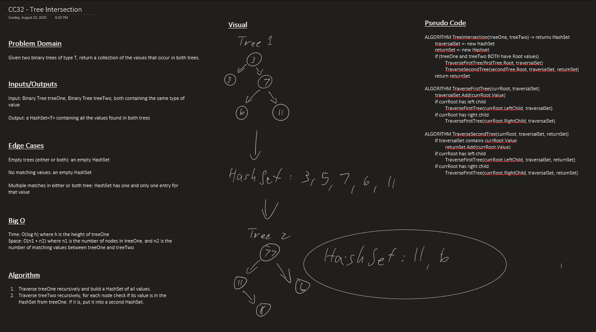

# Challenge 32: Tree Intersection

A class library with a single public method. This method takes two Tree<T> objects, and returns a HashSet<T> of all the values that occur in both trees.

- `GetMatchingValuesFor()`: given two Tree<T> objects, returns a HashSet<T> of all the values in both trees.

## Approach & Efficiency

- `GetMatchingValuesFor()`
- Time: O(n), where n is the total number number of nodes in both trees
- Space: O(n), where n is the total number number of nodes in both trees

### Whiteboard

## Link(s) to Code

- [TreeIntersection.cs](TreeIntersection/TreeIntersection.cs)

## Change Log

### 2020-08-18

- Initial implementation using HashSet<T>