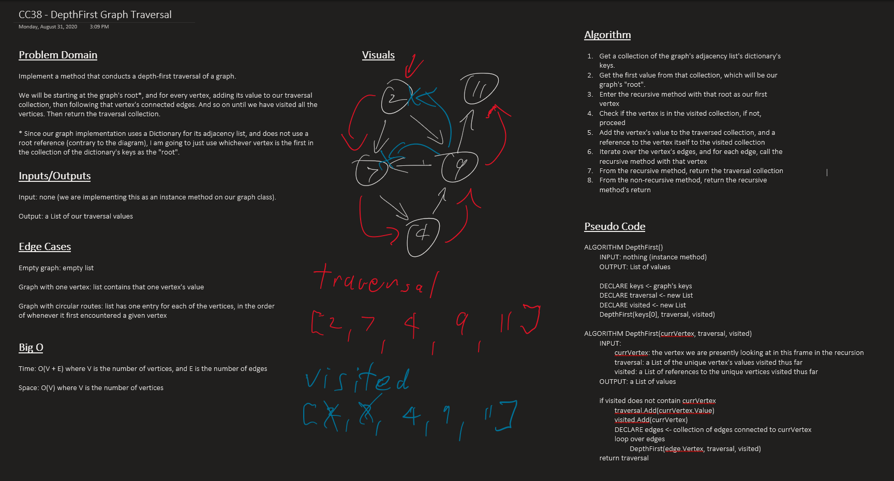

# Challenge 35 - 38: Graphs

An implementation of a directionally linked generic graph data structure. Employs the built-in C# Dictionary class for the graph's Adjacency List to hold the vertices and edges.

- `AddNode(T value)`: adds a new vertex to the graph with value T.
- `AddEdge(Vertex<T> vertexA, Vertex<T> vertexB, W weight)`: adds a new directional edge connecting vertexA to vertexB with weight W.
- `GetNodes()`: gets a List<Vertex<T>> of all the vertices presently in teh graph.
- `GetNeighbors(Vertex<T> vertex)`: gets a List<Edge<T, W>> of the edges originating from the parameter vertex.
- `Size()`: returns an int signifying the curren number of vertices in the graph.
- `BreadthFirst(Vertex<T> vertex)`: returns a breadth first traversal of the graph as a List<Vertex<T>>.
- `GetEdges(string[] cities)`: assumes the graph is modeling connected cities with the cost of traveling between them being the weight of the edges. Returns a tuple with a boolean, true if the graph can be traversed in the order from the parameter array, and an int that is the total cost of the trip across those various cities, or zero if the trip is not possible.
- `DepthFirst()`: returns a depth first traversal of the graph as a List<Vertex<T>>. The instructions specified to begin at the graph's "root", but as we implemented the graph as an adjacency list, there is no "root". Getting the adjacency list's dictionary's collection of keys, and using the first key from that collection as the "root".

## Approach & Efficiency

- `AddNode(T value)`:
    - Time: O(1)
    - Space: O(1)
- `AddEdge(Vertex<T> vertexA, Vertex<T> vertexB, W weight)`:
    - Time: O(1)
    - Space: O(1)
- `GetNodes()`:
    - Time: O(n)
    - Space: O(n)
- `GetNeighbors(Vertex<T> vertex)`:
    - Time: O(n)
    - Space: O(n)
- `Size()`:
    - Time: O(1)
    - Space: O(1)
- `BreadthFirst(Vertex<T> vertex)`:
    - Time: O(V + E): where V is the number of vertices, and E is the number of edges
    - Space: O(V): where V is the number of vertices
- `GetEdges(string[] cities)`:
    - Time: O(V + E): where V is the number of vertices, and E is the number of edges
    - Space: O(V): where V is the number of vertices
- `DepthFirst()`:
    - Time: O(V + E): where V is the number of vertices, and E is the number of edges
    - Space: O(V): where V is the number of vertices

## Links to Code

- [Graph.cs](Graph/Classes/Graph.cs)
- [Vertex.cs](Graph/Classes/Vertex.cs)
- [Edge.cs](Graph/Classes/Edge.cs)
- [BreadthFirst()](Graph/Classes/Graph.cs#L103-L139)
- [GetEdges()](Graph/Classes/Graph.cs#L200-L285)
- [DepthFirst()](Graph/Classes/Graph.cs#L159-L197)

## Whiteboards

### Breadth First Traversal

### Get Edges

### Depth First Traversal

## Change Log

### 2020-08-24
- Added BreadthFirst()

### 2020-08-24
- Initial implementation and tests